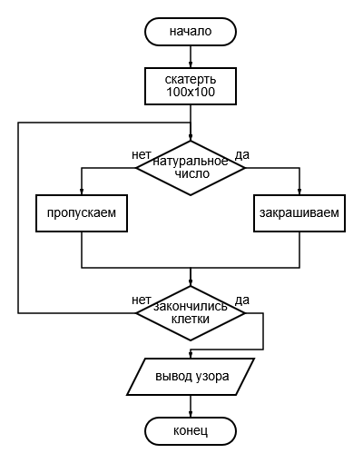

# friendlySERVERmiao
### Винокурова Мария 28ИПо8481

---

# Отчёт по задаче «Скатерть Улама» (C++)

---

## Содержание

1. [Задача](#1-задача)
2. [Вербальная модель](#2-вербальная-модель)
   - [2.1. Генерация спирали Улама](#21-генерация-спирали-улама)
   - [2.2. Проверка числа на простоту](#22-проверка-числа-на-простоту)
   - [2.3. Клиент-серверное взаимодействие](#23-клиент-серверное-взаимодействие)
3. [Математическая модель](#3-математическая-модель)
   - [3.1. Спираль Улама](#31-спираль-улама)
   - [3.2. Простые числа](#32-простые-числа)
   - [3.3. Координаты клетки](#33-координаты-клетки)
4. [Код программы](#4-код-программы)
   - [4.1. Основной сервер (server.cpp)](#41-основной-сервер-servercpp)
   - [4.2. Клиент (client.cpp)](#42-клиент-clientcpp)
5. [Вывод](#5-вывод)
6. [Заключение](#6-заключение)

---

## 1. Задача

> **Задача 33:**  

> Однажды математик С. Улам разделил лист бумаги на клетки и, написав в центре 1, начал писать по спирали против часовой стрелки все натуральные числа подряд, выделяя простые числа. Скоро простые числа выстроились в довольно-таки закономерном порядке, образуя интересный узор. Этот узор позже стал объектом исследования и получил название скатерть Улама.  
> **Составьте программу, демонстрирующую скатерть Улама размером 100 × 100 клеток (вместо простых чисел выводите звездочку “*”).**

Дополнительно в рамках задания  реализовано клиент-серверное взаимодействие:  
- Сервер принимает команды от клиента.  
- По команде `-s` генерирует скатерть Улама и возвращает её клиенту.  
- Клиент отправляет команды и отображает полученный узор.

---

## 2. Вербальная модель

Программа работает следующим образом:

1. **Генерация спирали Улама**  
   - Создаётся квадратная матрица (двумерный массив) размером 100×100, заполненная пробелами.  
   - Начальная точка — центр матрицы (координаты x = 50, y = 50).  
   - Движение по спирали **против часовой стрелки** с шаблоном: вправо → вверх → влево → вниз.  
   - Каждой клетке присваивается натуральное число n, начиная с 1 в центре.  
   - Если число **простое**, в клетку записывается `*`, иначе — пробел.

2. **Проверка числа на простоту**  
   - Число 1 — не простое.  
   - 2 — простое.  
   - Чётные числа > 2 — не простые.  
   - Для остальных чисел проверяются делители до √n.

3. **Клиент-серверное взаимодействие**  
   - Сервер слушает порт 8080.  
   - Клиент подключается к серверу и отправляет команды:  
     - `-s` — получить скатерть Улама.  
     - `-h` — справка.  
     - `-v` — версия.  
     - `-a` — автор.  
     - `ping` — проверка связи.  
     - `exit` — выход.  
   - Сервер обрабатывает команду и возвращает результат (для `-s` — строку с узором).  
   - Клиент выводит ответ на экран.

---

## 3. Математическая модель

### 3.1. Спираль Улама

Спираль Улама — это способ укладки натуральных чисел на квадратную решётку, начиная с 1 в центре и двигаясь по спирали против часовой стрелки.

**Правило обхода** (для против часовой стрелки, начиная с движения вправо):

```
Шаг 1: вправо 1 клетку
Шаг 2: вверх 1 клетку
Шаг 3: влево 2 клетки
Шаг 4: вниз 2 клетки
Шаг 5: вправо 3 клетки
Шаг 6: вверх 3 клетки
...
Длина шага увеличивается каждые 2 направления.
```

### 3.2. Простые числа

Число  *p* называется простым, если:


- p > 1

- *∀d* ∈ [2, √*p*] : *p* mod *d* ≠ 0


Для оптимизации:
- Проверяем только нечётные делители (кроме 2).
- Останавливаемся при первом найденном делителе.

### 3.3. Координаты клетки

Пусть:
- size = 100

- center = size / 2 = 50

Тогда координаты клетки с числом *n*:

- *x*(*n*), *y*(*n*) ∈ [0, 99]

- Начальная точка: (*x*₀, *y*₀) = (50, 50) для *n* = 1.

---

## 4. Блок-схема



---

## 5. Код программы

### 5.1. Основной сервер (server.cpp)

```cpp
#include <iostream>     
#include <vector>       
#include <string>       
#include <cmath>        
#include <cstring>      
#include <algorithm>    
#include <sys/socket.h> 
#include <netinet/in.h> 
#include <arpa/inet.h>  
#include <unistd.h>     
#include <sstream>      

using namespace std;

// информация о программе
const string AUTHOR = "Miao";     // автор
const string VERSION = "1.2.3.";  // версия
const int PORT = 8080;            // порт сервера
const int BUFFER_SIZE = 1024;     // размер буфера

//  проверка числа на простое
bool is_prime(int n) {
    if (n < 2) return false;          // числа < 2 не простые
    if (n % 2 == 0 && n != 2) return false; // чётные (кроме 2) не простые

    // проверяем делители до sqrt(n)
    for (int i = 3; i <= sqrt(n); i += 2)
        if (n % i == 0) return false;

    return true;
}

//  генерация спирали
string generate_spiral() {
    const int size = 30; // размер поля
    vector<vector<char>> grid(size, vector<char>(size, ' ')); // 2D поле

    int x = size / 2, y = size / 2; // старт из центра
    int step = 1, count = 0, dir = 0;

    // направления движения: вправо, вверх, влево, вниз
    int dx[] = {1, 0, -1, 0};
    int dy[] = {0, -1, 0, 1};

    // заполняем поле
    for (int n = 1; n <= size * size; n++) {

        // если внутри границ — записываем символ
        if (x >= 0 && x < size && y >= 0 && y < size)
            grid[y][x] = is_prime(n) ? '*' : ' ';

        // двигаемся
        x += dx[dir];
        y += dy[dir];
        count++;

        // смена направления
        if (count == step) {
            count = 0;
            dir = (dir + 1) % 4;

            // увеличиваем шаг каждые 2 поворота
            if (dir % 2 == 0) step++;
        }
    }

    // превращаем поле в строку
    stringstream ss;
    for (auto& row : grid) {
        for (char c : row) ss << c << ' ';
        ss << '\n';
    }

    return ss.str();
}

// обработка команд клиента
string handle_command(const string& msg) {

    if (msg == "-h") {
        return "help u :)\n Commands:\n-h help\n-v version\n-a author\n-s spiral\nexit\n";
    }
    else if (msg == "-v") {
        return "Version: " + VERSION + "\n";
    }
    else if (msg == "-a") {
        return "Author: " + AUTHOR + "\n";
    }
    else if (msg == "-s") {
        return generate_spiral(); // возвращаем спираль
    }
    else if (msg == "ping") {
        return "pong\n";
    }
    else {
        return "Unknown command (-h for help)\n";
    }
}

//  основной сервер
int main() {

    // создаём TCP сокет
    int serverSocket = socket(AF_INET, SOCK_STREAM, 0);

    // разрешаем повторное использование порта
    int opt = 1;
    setsockopt(serverSocket, SOL_SOCKET, SO_REUSEADDR, &opt, sizeof(opt));

    // структура адреса сервера
    sockaddr_in addr{};
    addr.sin_family = AF_INET;        
    addr.sin_port = htons(PORT);      
    addr.sin_addr.s_addr = INADDR_ANY; 

    // привязка сокета к адресу
    bind(serverSocket, (sockaddr*)&addr, sizeof(addr));

    // перевод в режим ожидания подключений
    listen(serverSocket, 5);

    cout << "Server started on port " << PORT << endl;

    // бесконечный цикл сервера
    while (true) {

        sockaddr_in clientAddr{};
        socklen_t size = sizeof(clientAddr);

        // принимаем клиента
        int client = accept(serverSocket, (sockaddr*)&clientAddr, &size);
        cout << "Client connected\n";

        char buffer[BUFFER_SIZE];

        // цикл общения с клиентом
        while (true) {
            memset(buffer, 0, BUFFER_SIZE); // очистка буфера

            // получаем данные
            int bytes = recv(client, buffer, BUFFER_SIZE - 1, 0);

            if (bytes <= 0) break; // клиент отключился

            string msg(buffer);

            // удаляем переносы строк
            msg.erase(remove(msg.begin(), msg.end(), '\n'), msg.end());
            msg.erase(remove(msg.begin(), msg.end(), '\r'), msg.end());

            if (msg == "exit") break; // выход клиента

            // обработка команды
            string response = handle_command(msg);

            response += "END\n"; //  маркер конца сообщения

            // отправка ответа клиенту
            send(client, response.c_str(), response.size(), 0);
        }

        // закрываем соединение с клиентом
        close(client);
        cout << "Client disconnected\n";
    }

    // закрываем сервер
    close(serverSocket);

    /**
 * @brief Проверка числа на простоту
 * @param n число
 * @return true если простое
 */
bool is_prime(int n);
}

```

### 4.2. Клиент (client.cpp)

```cpp
#include <iostream>
#include <string>
#include <cstring>
#include <arpa/inet.h>
#include <unistd.h>

using namespace std;

const char* IP = "127.0.0.1";
const int PORT = 8080;
const int BUFFER_SIZE = 1024;

int main() {

    // создаём TCP сокет
    int sock = socket(AF_INET, SOCK_STREAM, 0);

    // структура, где храним адрес сервера
    sockaddr_in server{};

    
    server.sin_family = AF_INET;

    // порт (переводим в сетевой формат)
    server.sin_port = htons(PORT);

    // перевод IP строки в бинарный формат
    inet_pton(AF_INET, IP, &server.sin_addr);

    // подключаемся к серверу
    if (connect(sock, (sockaddr*)&server, sizeof(server)) < 0) {
        cout << "Connect error\n";
        return 1;
    }

    cout << "Connected!\n";

    // бесконечный цикл общения с сервером
    while (true) {

        // ввод команды от пользователя
        cout << "> ";
        string msg;
        getline(cin, msg);

        // если пусто — пропускаем
        if (msg.empty()) continue;

        // добавляем перевод строки (серверу так проще читать)
        msg += "\n";

        // отправляем сообщение серверу
        send(sock, msg.c_str(), msg.size(), 0);

        // если команда exit — выходим
        if (msg == "exit\n") break;

        // буфер для ответа сервера
        string response;
        char buffer[BUFFER_SIZE];

        // читаем ответ 
        while (true) {

            // очищаем буфер
            memset(buffer, 0, BUFFER_SIZE);

            // получаем данные от сервера
            int bytes = recv(sock, buffer, BUFFER_SIZE - 1, 0);

            // если сервер отключился
            if (bytes <= 0) break;

            // добавляем часть ответа
            response += buffer;

            // проверяем конец сообщения
            if (response.find("END\n") != string::npos)
                break;
        }

        // убираем служебный маркер END
        size_t pos = response.find("END\n");
        if (pos != string::npos)
            response.erase(pos);

        // выводим ответ сервера
        cout << response << endl;
    }

    // закрываем соединение
    close(sock);
}
```

---

## 5. Вывод

В результате выполнения программы:
- Сервер запускается на порту 8080 и ожидает подключения клиентов.
- Клиент подключается и отправляет команду `-s`.
- Сервер генерирует **скатерть Улама размером 100×100**:
  - В центре — число 1 (пробел, так как 1 не простое).
  - Вокруг по спирали раскладываются числа 2, 3, 4, …
  - Простые числа отмечены символом `*`.
  - Получается характерный узор с диагональными скоплениями звёздочек.
- Клиент получает и отображает этот узор в консоли.

Таким образом, программа полностью выполняет поставленную задачу: демонстрирует скатерть Улама 100×100 с выделением простых чисел звёздочками, а также предоставляет удобный интерфейс для удалённого доступа.

---

## 6. Заключение

В ходе работы:
- Реализован алгоритм обхода чисел по спирали против часовой стрелки.
- Оптимизирована проверка чисел на простоту.
- Создана клиент-серверная архитектура на сокетах TCP/IP.
- Скатерть Улама размером 100×100 успешно генерируется и передаётся клиенту.
- Программа демонстрирует наглядный пример визуализации математического явления — упорядоченности простых чисел в спиральной укладке.


**Заключение:** задача решена в полном объёме с расширением функциональности в виде сетевого взаимодействия.